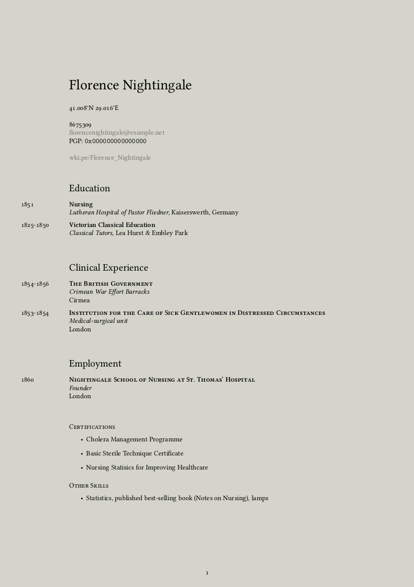

# Nurse Resume

> I consider LaTeX resumes to be a secret handshake of sorts, something that makes me significantly more likely to be inclined to hire a candidate.  
> &mdash;<cite>[zackelan](https://news.ycombinator.com/item?id=10452606)<cite> on HN

A boilerplate to ease the pain of building and maintaining a resume for RN's using LaTeX.

## Features
* Type your resume in a text based format and let LaTeX do the typesetting
* Spot to put your PGP key ID
* Clinical experience section
* Spot for nursing certifications
* Easily update and export your resume
* Super customizable

## Intro

Separating presentation from content makes life easier. The typical content of a CV or resume is a perfect fit for a YAML file due to its structured nature. Here is the file you edit, inserting your own informations:

```YAML
---
# Personal details
name: Florence Nightingale
address:
- 41.008°N 29.016°E
#- address line 2
phone: "8675309"
email: florencenightingale@example.net
pgp: 0x000000000000000
# Insert URLs without http://
urls:
- wki.pe/Florence_Nightingale


# Sections

#you can write about yourself here, if you want. Just uncomment the line below.
#intro: "The very first requirement in a hospital is that it should do the sick no harm."


education:
- year: 1851
  subject: Nursing
  institute: Lutheran Hospital of Pastor Fliedner
  city: Kaiserswerth, Germany
- year: 1825-1850
  subject: Victorian Classical Education
  institute: Classical Tutors
  city: Lea Hurst & Embley Park

clinical-experience:
- years: 1854-1856
  employer: The British Government
  unit: Crimean War Effort Barracks
  city: Cirmea
- years: 1853-1854
  employer: Institution for the Care of Sick Gentlewomen in Distressed Circumstances
  unit: Medical-surgical unit
  city: London

# Other, non-clinical Employment
employment:
- years: 1860
  employer: Nightingale School of Nursing at St. Thomas’ Hospital
  job: Founder
  city: London

# this section is for nursing certification (NIH, BLS, ACLS, etc.)
skills:

- Cholera Management Programme
- Basic Sterile Technique Certificate
- Nursing Statisics for Improving Healthcare

# other skills you are good at or non-nursing certifications

other-skills:
- Statistics, published best-selling book (Notes on Nursing), lamps


# Settings
mainfont: "Linux Libertine O"
fontsize: 10pt
lang: English
geometry: a4paper, left=35mm, right=35mm, top=40mm, bottom=17mm
---
```

That makes super easy to update a resume while keeping a consistent structure.

Thanks to [pandoc](http://pandoc.org/), LaTeX takes then care of the typesetting with its usual elegance. Below a preview of the final result with a colored background added for contrast (and so you can see the white-space). Check out the [output](output.pdf) to see the compiled PDF.



With this method, you can keep your entire resume encoded in a single YAML file, put it under version control (into a gist, for instance), and generate a PDF on the fly when needed. You can also easily export it to other formats, like HTML for web publishing (I've heard [Jekyll](http://jekyllrb.com/) likes YAML). Convenient, portable and time-proof.

## Dependencies

1. LaTeX with the following extra packages: `fontspec` `geometry` `multicol` `xunicode` `xltxtra` `marginnote` `sectsty` `ulem` `hyperref` `polyglossia`
2. [Pandoc](http://pandoc.org/), the universal document converter.

To install LaTeX on Mac OS X, I recommend getting the smaller version BasicTeX from [here](https://tug.org/mactex/morepackages.html) and installing the additional packages with `tlmgr` afterwards. Same goes for Linux: install `texlive-base` with your package manager and add the needed additional packages later.

To install pandoc on Mac OS X, run `brew install pandoc`. To install it on Linux, refer to the [official docs](http://pandoc.org/installing.html).

## Getting started

1. Fill `details.yml` with your personal details, work experience, education, and desired settings.
2. Run `make` to compile the PDF.
3. Tweak on `template.tex` until you're satisfied with the result.

**Note**: this template needs to be compiled with XeTeX.

### Note for Windows users

Although I didn't test it, you can probably use this on Windows, too. Both [Pandoc](http://pandoc.org/installing.html) and LaTeX can be installed on Windows (I recommend [MiKTeX](http://miktex.org/) for that) and you should be able to run makefiles on Windows through [Cygwin](https://www.cygwin.com/). If that's too much hassle, this command should do the trick in Powershell:

    pandoc details.yml -o output.pdf --template=template.tex --latex-engine=xelatex

## Available settings

- **`mainfont`**: "Linux Libertine O" is the default, but every font installed on your system should work out of the box (thanks, XeTeX!)
- **`fontsize`**: Possible values here are 10pt, 11pt and 12pt.
- **`lang`**: Sets the main language through the `polyglossia` package. This is important for proper hyphenation, among other things.
- **`geometry`**: A string that sets the margins through `geometry`. Read [this](https://www.sharelatex.com/learn/Page_size_and_margins) to learn how this package works.

## Recommended readings

- [Typesetting Automation](http://mrzool.cc/writing/typesetting-automation/), my article about this project with in-depth instructions and some suggestions for an ideal workflow.
- [Why I do my résumé in LaTeX](http://www.toofishes.net/blog/why-i-do-my-resume-latex/) by Dan McGee
- [What are the benefits of writing resumes in TeX/LaTeX?](http://tex.stackexchange.com/questions/11955/what-are-the-benefits-of-writing-resumes-in-tex-latex) on TeX Stack Exchange
- [Typesetting your academic CV in LaTeX](http://nitens.org/taraborelli/cvtex) by Dario Taraborelli
- [Résumé advices](http://practicaltypography.com/resumes.html) from Butterick's Practical Typography 

## Resources

- Refer to [pandoc's documentation](http://pandoc.org/demo/example9/templates.html) to learn more about how templates work.
- If you're not familiar with the YAML syntax, [here](http://learnxinyminutes.com/docs/yaml/)'s a good overview.
- If you want to edit the template but LaTeX scares you, these [docs](https://www.sharelatex.com/learn/Main_Page) put together by ShareLaTeX cover most of the basics and are surprisingly kind to the beginner.
- Odds are your question already has an answer on [TeX Stack Exchange](https://www.sharelatex.com/learn/Main_Page). Also, pretty friendly crowd in there.

## License

This repository contains a modified version of mrzool's [cv-boilerplate](https://github.com/mrzool/cv-boilerplate) template.

License: [CC BY-SA 3.0](http://creativecommons.org/licenses/by-sa/3.0/)
